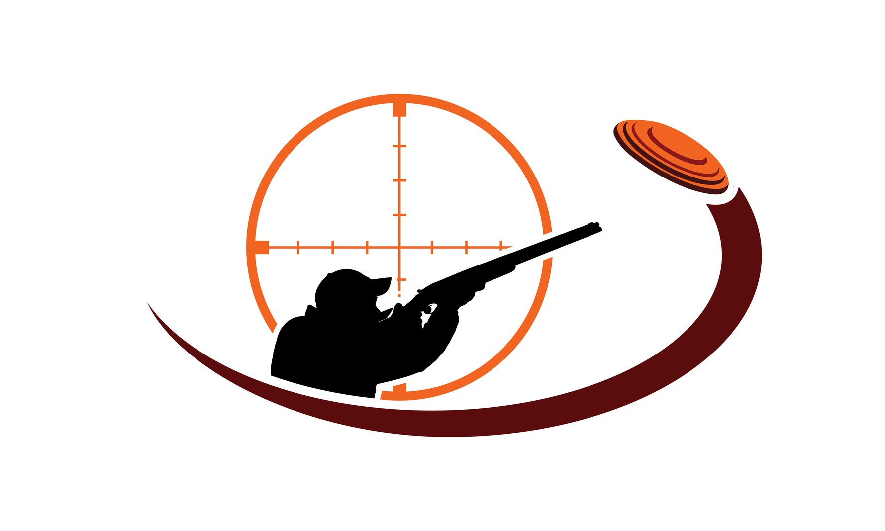

# lesson3.3 Игра_тир

## Описание

Игра __"Тир"__ - это простая игра, в которой игрок должен кликать по цели, чтобы заработать очки. За каждое попадание по цели игрок получает очки, а за промах - теряет. Цель после каждого попадания перемещается в случайное место на экране.

